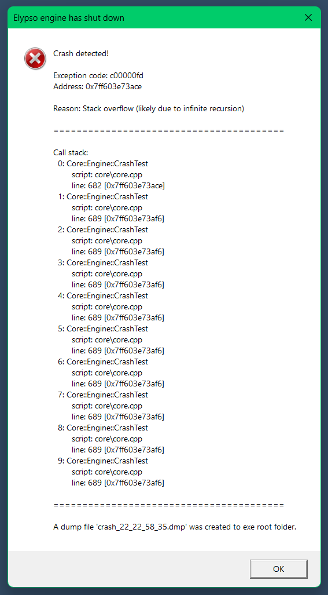

## Introduction

CrashHandler is a lightweight C++ 20 library that detects crashes caused by the program the crash handler is attached to. You can display crash messages in Windows error popup and generate a log file with extra info and a dmp file for debugging.



## How to use

```cpp
#include <string>
#include <cstdlib> //for shutting down program

#include "crashHandler.hpp"

using ElypsoUtils::CrashHandler;

static void Shutdown()
{
    exit(1); //non-zero - error
}

int main()
{
    //call this function to initialize crash handler
    CrashHandler::Initialize();

    //attach a string to this function to set the name of the program that will be displayed when the program crashes
    std::string name = "MyProgramName";
    CrashHandler::SetProgramName(name);

    //attach any function similarly to this that will be called
    //once the user presses Ok or closes the error popup
    CrashHandler::SetShutdownCallback([] { Shutdown(); });

    return 0;
}
```

## Types of crashes that are supported

### Access violation

```cpp
#include <iostream>

int AccessViolation()
{
    int* ptr = nullptr; // Null pointer
    std::cout << *ptr << std::endl; // Crash: access violation
    return 0;
}
```

### Memory access failed (IN_PAGE_ERROR)

```cpp
#include <windows.h>

int InPageError()
{
    char* ptr = (char*)VirtualAlloc(nullptr, 4096, MEM_RESERVE, PAGE_NOACCESS);
    *ptr = 1; // Accessing inaccessible memory page
    return 0;
}
```

### Datatype misalignment

```cpp
#include <malloc.h>

struct MisalignedStruct { double d; };

int DatatypeMisalignment()
{
    MisalignedStruct* m = (MisalignedStruct*)_aligned_malloc(sizeof(MisalignedStruct), 1);
    double crash = m->d; // Misaligned access
    _aligned_free(m);
    return (int)crash;
}
```

### Array bounds exceeded

```cpp
int ArrayBoundsExceeded()
{
    int arr[2] = {1, 2};
    int crash = arr[10]; // Out-of-bounds access
    return crash;
}
```

### Integer divide by zero

```cpp
int IntegerDivideByZero()
{
    int zero = 0;
    int crash = 42 / zero; // Integer divide by zero
    return crash;
}
```

### Floating-point divide by zero

```cpp
int FltDivideByZero()
{
    float zero = 0.0f;
    float crash = 1.0f / zero; // Floating-point divide by zero
    return (int)crash;
}
```

### Invalid floating-point operation

```cpp
#include <cmath>

int FltInvalidOperation()
{
    float invalid = std::sqrt(-1.0f); // NaN
    float crash = invalid + 1.0f;
    return (int)crash;
}
```

### Floating-point overflow

```cpp
int FltOverflow()
{
    float large = 1e38f;
    float crash = large * large; // Overflow
    return (int)crash;
}
```

### Floating-point underflow

```cpp
int FltUnderflow()
{
    float small = 1e-38f;
    float crash = small / 1e10f; // Underflow
    return (int)crash;
}
```

### Floating-point denormal operand

```cpp
int FltDenormalOperand()
{
    volatile float denorm = 1e-39f;
    float crash = denorm * 1.0f;
    return (int)crash;
}
```

### Illegal instruction

```cpp
typedef void (*CrashFunc)();

int IllegalInstruction()
{
    unsigned char code[] = { 0xFF, 0xFF, 0xFF, 0xFF }; // Invalid opcodes
    CrashFunc crash = (CrashFunc)code;
    crash(); // Execute invalid code
    return 0;
}
```

### Stack overflow

```cpp
void RecursiveCrash()
{
    RecursiveCrash(); // Infinite recursion
}

int StackOverflow()
{
    RecursiveCrash(); // Stack overflow
    return 0;
}
```
